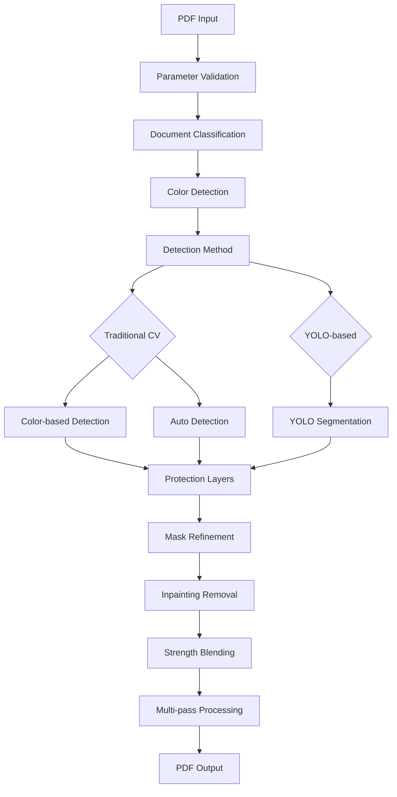

# CLI Workflow & Algorithm Composition Analysis

## Complete Processing Pipeline

### 1. Input Validation & Configuration Phase

```
PDF Input → Parameter Validation → YOLO Setup → Preset Handling
```

**Key Components:**
- **YOLO Validation**: Checks ultralytics availability, model existence
- **Preset Modes**: `electronic-color` for precise color-based removal
- **Parameter Parsing**: Pages, colors, detection method, strength settings

### 2. Document Intelligence Phase

```
First Page → Document Classification → Parameter Optimization
```

**Document Types:**
- **Electronic**: Discrete colors, pure black text, sharp edges
- **Scanned**: Continuous colors, noise, blurred edges  
- **Mixed**: Conservative parameters needed

**Optimization Parameters:**
```python
electronic_params = {
    "color_tolerance": 15,      # Strict color matching
    "inpaint_strength": 0.8,    # Gentle removal
    "kernel_size": 2,           # Small kernel
    "multi_pass": 2,            # Multi-pass for precision
    "dpi": 200                  # Higher resolution
}
```

### 3. Color Detection & Selection Phase

```
Interactive Selection → Color Analysis → Automatic Detection
```

**Detection Methods:**
- **Interactive**: User selects watermark color from preview
- **Automatic**: AI analyzes color distribution
- **Preset**: Pre-configured color for electronic documents

### 4. Core Processing Pipeline

```
PDF → Images → Detection → Removal → Images → PDF
```

## Algorithm Composition

### Detection Algorithms

#### A. Traditional CV Method (Default)
**Components:**
1. **Color-Based Detection** (when color specified)
   ```python
   # Precise color matching with tolerance
   color_diff = np.abs(gray - target_gray)
   color_mask = (color_diff < color_tolerance).astype(np.uint8) * 255
   ```

2. **Automatic Detection** (when no color specified)
   ```python
   # Adaptive thresholding + saturation analysis
   binary = cv2.adaptiveThreshold(gray, 255, cv2.ADAPTIVE_THRESH_GAUSSIAN_C, cv2.THRESH_BINARY, 11, 2)
   saturation_mask = (s_channel < saturation_threshold).astype(np.uint8) * 255
   combined_mask = cv2.bitwise_or(opened, saturation_mask)
   ```

3. **Protection Layers**
   - **Text Protection**: `gray < 150` (protects dark text)
   - **Background Protection**: `gray > 250` (preserves white background)

#### B. YOLO-based Method
**Models:**
- **YOLOv8n-seg**: Fast baseline model
- **YOLOv12n-seg**: Higher accuracy with region attention
- **YOLO11x-watermark**: Specialized watermark detection

### Removal Algorithm

#### Core: OpenCV Inpainting (TELEA)
```python
# Dynamic radius based on watermark coverage
watermark_coverage = np.count_nonzero(mask) / total_pixels
dynamic_radius = max(2, int(base_radius + coverage * 10 * strength))

# Convert RGB→BGR→RGB for color accuracy
image_bgr = cv2.cvtColor(image_rgb, cv2.COLOR_RGB2BGR)
restored_bgr = cv2.inpaint(image_bgr, mask, dynamic_radius, cv2.INPAINT_TELEA)
restored = cv2.cvtColor(restored_bgr, cv2.COLOR_BGR2RGB)
```

#### Strength Control
```python
# Blend based on strength: 0.5=light, 1.0=medium, 1.5=strong
blend_factor = mask_normalized * strength
result = original * (1 - blend_factor) + inpainted * blend_factor
```

#### Multi-pass Processing
```python
def remove_watermark_multi_pass(self, image_rgb, passes=2):
    # Progressive mask expansion instead of full reprocessing
    current_mask = initial_mask
    for pass_num in range(passes):
        # Expand mask slightly for each pass
        expanded_mask = cv2.dilate(current_mask, kernel, iterations=1)
        # Apply inpainting with updated mask
        result = cv2.inpaint(image, expanded_mask, radius, method)
        current_mask = expanded_mask
    return result
```

## Key Algorithmic Innovations

### 1. Intelligent Document Classification
**Multi-dimensional Analysis:**
- **Color Discreteness**: Electronic docs have fewer distinct colors
- **Text Concentration**: Pure black text (0-50 gray) indicates electronic doc
- **Edge Sharpness**: Electronic docs have sharper transitions
- **Noise Levels**: Scanned docs have higher noise

### 2. Dynamic Parameter Adjustment
```python
def get_optimal_parameters(doc_type, preset_mode=None):
    if preset_mode == "electronic-color":
        return {
            "color_tolerance": 15,      # Strict matching
            "inpaint_strength": 0.8,    # Gentle removal
            "multi_pass": 2,            # Multiple passes
            "protect_text": True        # Always protect text
        }
    
    if doc_type == DocumentType.ELECTRONIC:
        return {"color_tolerance": 20, "inpaint_strength": 0.9}
    elif doc_type == DocumentType.SCANNED:
        return {"color_tolerance": 40, "inpaint_strength": 1.2}
    else:  # MIXED
        return {"color_tolerance": 30, "inpaint_strength": 1.0}
```

### 3. Advanced Color Analysis
**Watermark Color Detection:**
```python
def detect_watermark_color(self, image_rgb):
    # Analyze top 10 most frequent colors
    for gray_val, count in top_colors:
        coverage = (count / total_pixels) * 100
        # Watermark characteristics: 100-250 gray, 1-20% coverage
        if 100 <= gray_val <= 250 and 1 <= coverage <= 20:
            return (gray_val, gray_val, gray_val)  # BGR format
```

### 4. Protection Mechanisms

#### Text Protection
```python
def get_text_protect_mask(self, gray):
    # Protect dark text (0-150 gray level)
    _, text_protect = cv2.threshold(gray, 150, 255, cv2.THRESH_BINARY_INV)
    # Remove small noise
    kernel = cv2.getStructuringElement(cv2.MORPH_RECT, (2, 2))
    text_protect = cv2.morphologyEx(text_protect, cv2.MORPH_OPEN, kernel, iterations=1)
    return text_protect
```

#### Background Protection
```python
# Protect white background (>250 gray)
_, background_mask = cv2.threshold(gray, 250, 255, cv2.THRESH_BINARY)
protected_mask = cv2.bitwise_and(color_mask, cv2.bitwise_not(background_mask))
```

## Performance Optimizations

### 1. Efficient Mask Refinement
```python
def refine_mask(self, mask, min_area=100, max_area=5000):
    # Remove small noise components
    num_labels, labels, stats, _ = cv2.connectedComponentsWithStats(mask)
    for i in range(1, num_labels):
        area = stats[i, cv2.CC_STAT_AREA]
        if area < min_area or area > max_area:
            mask[labels == i] = 0
    return mask
```

### 2. Coverage-based Processing
- **Low coverage** (<1%): Skip processing
- **Medium coverage** (1-10%): Standard processing
- **High coverage** (>10%): Multi-pass processing

### 3. Progressive Quality
- **Fast preview**: 150 DPI default
- **High quality**: 200+ DPI for final processing
- **Memory efficient**: Process pages individually

## Workflow Summary



## Error Handling & Robustness

### 1. Graceful Degradation
- **YOLO unavailable**: Falls back to traditional method
- **Color detection fails**: Uses automatic detection
- **Processing errors**: Can skip individual pages

### 2. Validation Layers
- **Input validation**: File existence, parameter ranges
- **Model validation**: YOLO model availability
- **Processing validation**: Mask quality checks

### 3. User Feedback
- **Progress tracking**: Multi-level progress bars
- **Statistics reporting**: Coverage, strength, performance metrics
- **Debug mode**: Preview masks for troubleshooting

This architecture provides a robust, intelligent watermark removal system that adapts to different document types and watermark characteristics while maintaining high quality output.